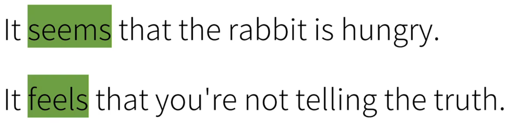

## 介绍：

**I  am  a  rabbit**

我是一只兔子，我开始认为它应该是主+谓+宾的形式

但是“a  rabbit”在此处并不是宾语，而是表语（主语补语）用于对主语的一种补充说明

"am"是谓语动词，连接主语和表达关于主语的信息。在这种情况下，“am”是表示等同关系的连系动词，而不是表示动作的及物动词。

所以表名了，只有当谓语表示为及物动词后面接的名词才可能是谓语

> 在英语中，系动词后面通常接的是表语，但并不总是这样。系动词的作用是连接主语与表达关于主语的陈述的词语。表语可以是名词、形容词、副词、介词短语或者是从句，而不仅仅局限于单个的名词或名词短语。
>
> 举个例子：
>
> - I am happy. （表语是形容词 "happy"）
> - She is a doctor. （表语是名词短语 "a doctor"）
> - He is in the kitchen. （表语是介词短语 "in the kitchen"）
> - This is where we live. （表语是从句 "where we live"）
>
> 因此，系动词后面可以接不同类型的表语，这取决于句子的结构和语境。

系动词常用的有哪些可以看动词篇中的系动词

表语从句（主语补语从句）往往就是把之前讲到的主语从句移到系动词之后

翻译有一点区别，主要在于需要强调的信息

这两句中的it并没有实际意义，只是占一个位置，句子实际要表达的意思是系动词后面的表语从句

## 区分：

**表语从句与宾语从句的区分**

> 表语从句和宾语从句是两种不同类型的从句，它们在句子中的位置和作用不同，可以通过以下几点来区分它们：
>
> 1. **位置**：
>    - 表语从句位于主语和谓语之间，作为谓语的一部分，用来对主语进行补充说明。
>    - 宾语从句位于及物动词或介词后面，作为动词的宾语，用来补充说明动词的行为对象。
>
> 2. **功能**：
>    - 表语从句用来描述主语的状态、特征或身份，起到对主语进行补充说明的作用。
>    - 宾语从句用来充当动词的宾语，描述动作的对象或内容。
>
> 3. **连词**：
>    - 表语从句通常由连系动词后面接从句构成，常见的连词有"be"、"seem"、"appear"等。
>    - 宾语从句通常由从属连词引导，常见的连词有"that"、"whether"、"if"等。
>
> 举例来说：
>
> - 表语从句：The important thing is [that you are happy].（重要的是你快乐。）
>   在这个例子中，“that you are happy”是表语从句，用来描述主语"thing"的状态。
>
> - 宾语从句：I know [that you are happy].（我知道你快乐。）
>   在这个例子中，“that you are happy”是宾语从句，充当动词"know"的宾语，描述了动作的内容。
>
> 通过理解这些区别，可以更准确地识别和使用表语从句和宾语从句。

## 遇到的案例

What's really remarkable, though, is where that fish comes from.  尽管一切，真正引人注目的是鱼来自何处

此处，though是一个副词，可以用于引导一个**让步状语从句**和一个**表语从句**

is是一个系动词
