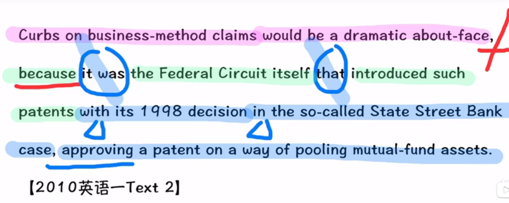

### 不认识词汇

- curb   控制，抑制,限制
- business-m ethod claims    专利
- dramatic  adj. 巨大而突然的，急剧的,巨大的
- about-face   （思想、态度、行为等）彻底改变；
- federal  联邦（制）的；（与）联邦政府（有关的）的；
- circuit  （英国）巡回审判区，巡回上诉法院；
- introduce  首次引入（某物）
- patent  专利
- approve  同意
- pool   集中（资源、钱财等）
- mutual  相互的，彼此的；共同的，共有的；
- asset  资产，财产

### 长难句分析

#### 先拆分长难句，“，”和连接词

  将第一个逗号进行划分，因为有逗号和连接词because 

> Tip
>
> 为何后面的逗号不进行分割呢?
>
> ​	因为它是动名词短语，可以晓得它不是一个完整的句子，所以就不需要进行划分

because后面接的是一个强调句，it was ……that……  ,前调 it was 和that中间的内容

英语中的**强调结构（Cleft Sentence）**，它确实是为了突出句子的某一部分。在这种结构中，"it" 是形式主语，而 "that" 引导的是从句，用来强调具体的信息。以下是几种常见的强调句式：

1. **强调主语（Subject）**：
   - 原句：John completed the project.
   - 强调句：**It was John that completed the project.**
   - 解析：强调的是 "John"，即完成项目的人。

2. **强调宾语（Object）**：
   - 原句：The teacher gave the book to Mary.
   - 强调句：**It was the book that the teacher gave to Mary.**
   - 解析：强调的是 "the book"，即老师给了玛丽的东西。

3. **强调时间状语（Adverbial of Time）**：
   - 原句：She met him last night.
   - 强调句：**It was last night that she met him.**
   - 解析：强调的是 "last night"，即她见到他的时间。

4. **强调地点状语（Adverbial of Place）**：
   - 原句：They found the key in the garden.
   - 强调句：**It was in the garden that they found the key.**
   - 解析：强调的是 "in the garden"，即他们找到钥匙的地点。

5. **强调方式状语（Adverbial of Manner）**：
   - 原句：She spoke to him politely.
   - 强调句：**It was politely that she spoke to him.**
   - 解析：强调的是 "politely"，即她与他说话的方式。

6. **强调原因状语（Adverbial of Reason）**：
   - 原句：He left because of the weather.
   - 强调句：**It was because of the weather that he left.**
   - 解析：强调的是 "because of the weather"，即他离开的原因。

在这些例子中，“it” 是形式主语，真正的主语或句子被强调的部分是 "that" 引导的从句。这个结构用于在特定语境下突出某一部分信息，使其在句子中显得更为重要和醒目。